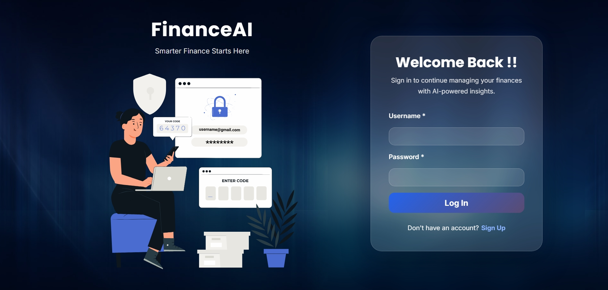
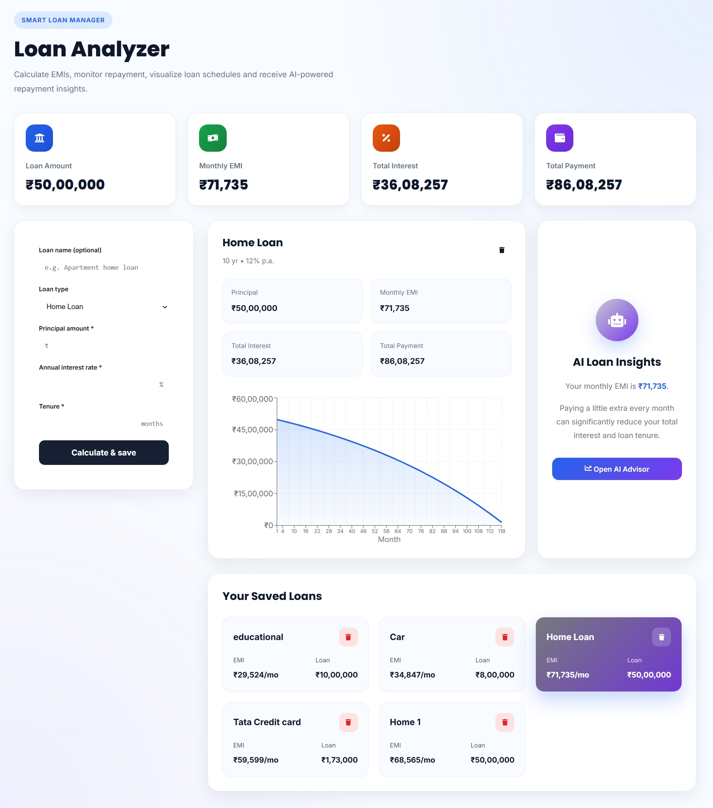
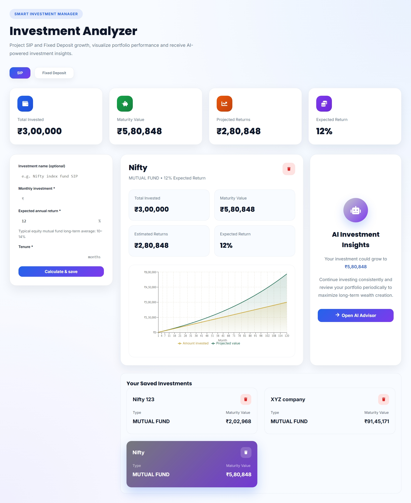
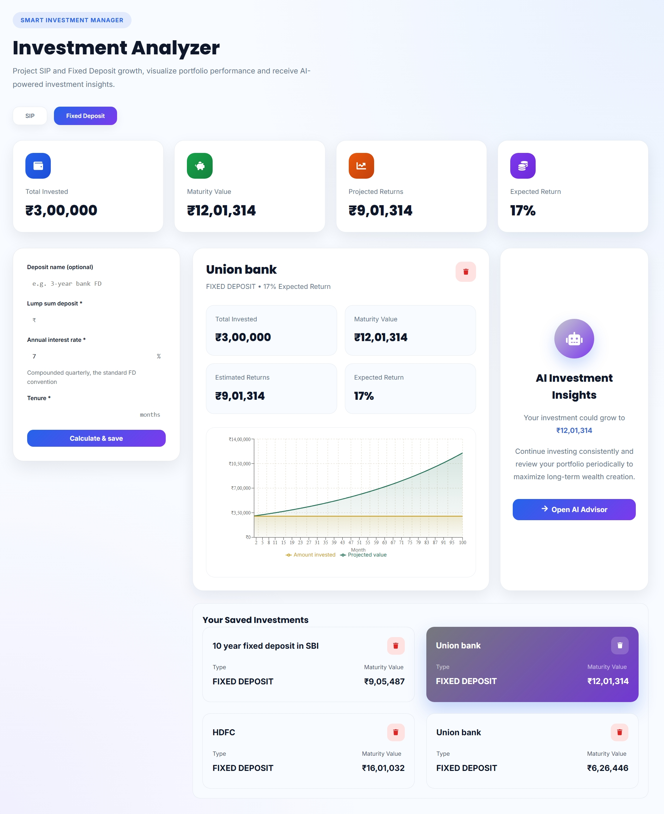
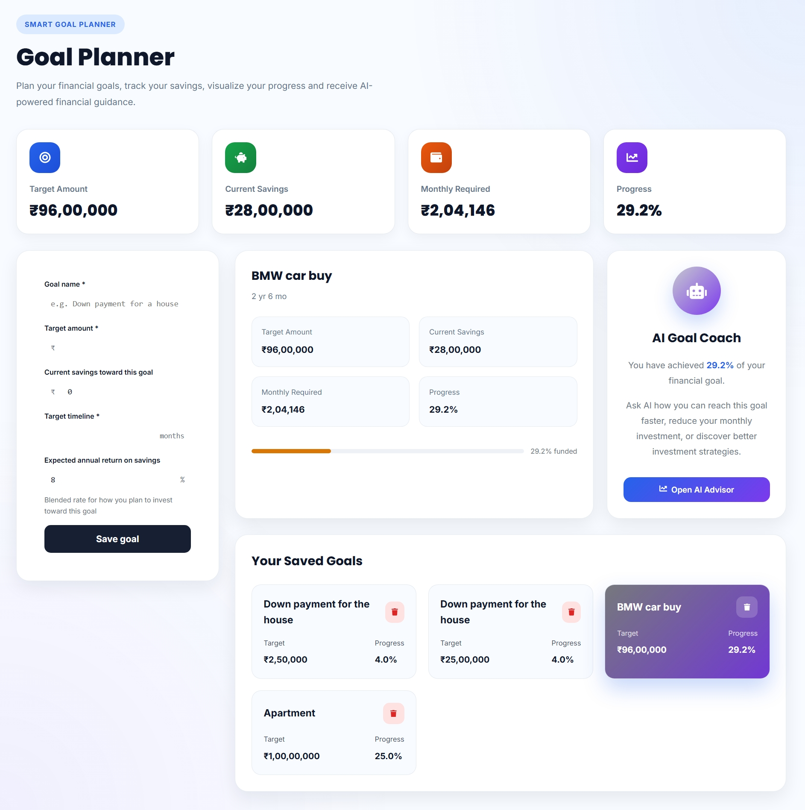
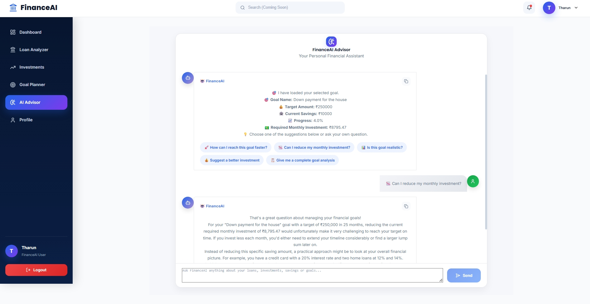

# 💰 Personal Finance AI Analyzer

An AI-powered Personal Finance Management platform that helps users track expenses, analyze investments, calculate loans, plan financial goals, and receive AI-driven financial insights.

---

## 🚀 Live Demo

### 🌐 Frontend
https://personal-finance-ai-analyzer.vercel.app

### ⚙ Backend API
https://personal-finance-ai-analyzer-mjlo.onrender.com

---

# ✨ Features

- 🔐 JWT Authentication
- 👤 User Registration & Login
- 📊 Dashboard Analytics
- 💰 Investment Analyzer
- 🏦 Loan Analyzer
- 🎯 Goal Planner
- 🤖 AI Financial Advisor
- 📈 Charts & Reports
- 👤 Profile Management
- 🌙 Modern Responsive UI
- ☁ Cloud Deployment

---

# 🛠 Tech Stack

## Frontend

- React 19
- Vite
- React Router
- Axios
- Recharts
- Lottie React
- CSS

## Backend

- Java 17
- Spring Boot 3
- Spring Security
- JWT Authentication
- Spring Data MongoDB
- Maven

## Database

- MongoDB Atlas

## Deployment

- Vercel (Frontend)
- Render (Backend)
- MongoDB Atlas (Database)

---

# 📂 Project Structure

```
Personal-Finance-AI-Analyzer
│
├── frontend
│   ├── src
│   ├── public
│   └── package.json
│
├── backend
│   ├── src
│   ├── pom.xml
│   └── Dockerfile
│
└── README.md
```

---

# ⚙ Installation

## Clone Repository

```bash
git clone https://github.com/KothintiTharun035/Personal-Finance-AI-Analyzer.git

cd Personal-Finance-AI-Analyzer
```

---

# Frontend Setup

```bash
cd frontend

npm install

npm run dev
```

Runs on

```
http://localhost:5173
```

---

# Backend Setup

```bash
cd backend

./mvnw spring-boot:run
```

Runs on

```
http://localhost:8080
```

---

# Environment Variables

## Frontend (.env)

```env
VITE_API_URL=http://localhost:8080/api
```

---

## Backend

```properties
SPRING_DATA_MONGODB_URI=your_mongodb_uri

JWT_SECRET=your_secret_key

JWT_EXPIRATION=86400000
```

---

# Screenshots


- Landing Page


- Login


- Register


- Dashboard


- Loan Calculator


- Investment SIP Analyzer


- Investment FD Analyzer


 
- Goal Planner


- AI Advisor


---

# API Endpoints

## Authentication

```
POST /api/auth/register

POST /api/auth/login
```

## User

```
GET /api/users/profile

PUT /api/users/profile
```

## Investments

```
GET /api/investments

POST /api/investments
```

## Loans

```
GET /api/loans

POST /api/loans
```

---

# Deployment

## Frontend

Deployed using **Vercel**

## Backend

Deployed using **Render**

## Database

Hosted on **MongoDB Atlas**

---

# Future Improvements

- AI Budget Prediction
- Expense OCR
- Stock Market Integration
- Email Notifications
- Mobile Application
- Dark Mode
- PDF Financial Reports

---

# Author

**Kothinti Tharun**

GitHub

https://github.com/KothintiTharun035


---

# License

This project is licensed under the MIT License.

⭐ If you found this project useful, don't forget to star the repository!